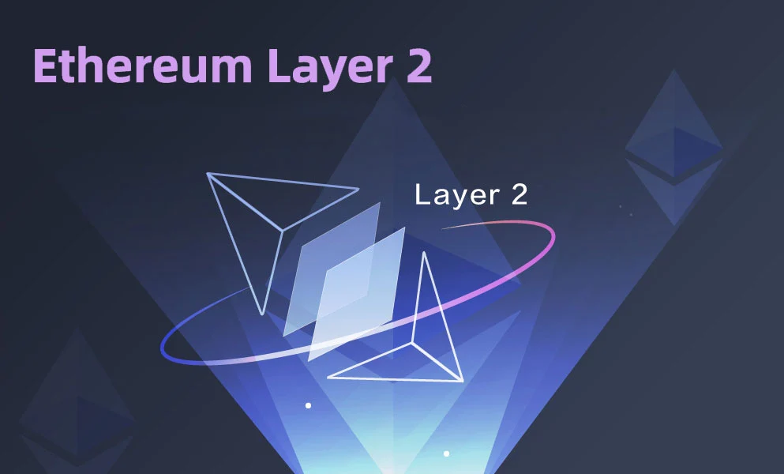
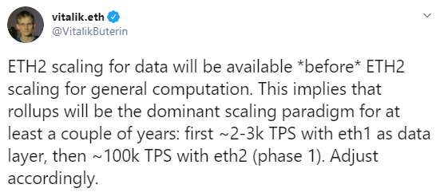

# Les L2, futur d'Ethereum

  

Cette petite leçon reprend ce qui a été dit oralement lors de la séance dédie. On abordera ici les ZK-Rollups — la technologie sous-jacente qui alimente notre protocole sans permission.
Des ressources supplémentaires sont disponibles tout au long de la leçon pour approfondir vos connaissances.

## ZK-Rollups : L'Avenir d'Ethereum

On dit que l'avenir d'Ethereum sera construit sur les ZK-Rollups. Plus économique, plus rapide, et sécurisé ! Beaucoup de personnes croient en cette vision, et selon Vitalik, le scaling via Layer 2 et la confidentialité sont là pour rester (voir son [papier ici](https://vitalik.ca/general/2023/10/31/l2types.html)).

  

### L1s et L2s : Les Fondations et Extensions

- **Layer 1** est l'architecture sous-jacente de la blockchain principale, comme Ethereum. C'est la fondation sur laquelle les réseaux L2 sont construits, leur fournissant sécurité et décentralisation.
- **Layer 2** est une extension d'Ethereum qui offre de la scalabilité à travers des transactions plus rapides et moins coûteuses sans compromettre la sécurité de la chaîne principale.

#### Exemple

- **L1**: Bitcoin, Ethereum
- **L2**: Lightning Network pour Bitcoin |  Starknet, Polygon, Arbitrum, Optimism ou Zksync pour Ethereum

Ethereum prévoit d'utiliser à la fois des solutions Layer 1 (sharding) et Layer 2 (rollups) pour résoudre le [trilemme de scalabilité](https://www.ledger.com/academy/what-is-the-blockchain-trilemma).

### Fonctionnement de Layer 2

Layer 2 interagit avec Ethereum (Layer 1) en prenant une partie des transactions. En éloignant cette charge transactionnelle de Layer 1, la couche de base devient moins congestionnée, et l'écosystème devient plus scalable.

#### Avantages

- **L1** — Décentralisation, Sécurité, et Disponibilité des données
- **L2** — Scalabilité, Vitesse, et Coût-efficacité

### Rollups : La Solution Privilégiée de Layer 2

Les Rollups sont les solutions L2 privilégiées pour scaler Ethereum pour le moment. Ils regroupent des centaines de transactions sur L2, les compacte en une seule grosse transaction qui sera envoyée sur le L1. Cela permet de disperser les frais de transaction parmi tous les utilisateurs du rollup. De plus, en postant les transactions sur L1, les rollups profitent de la sécurité d'Ethereum.

**⚠️ Attention:** Cette explication est simplifiée pour avoir l'intuition de base. Pour une explication plus détaillée, vous pouvez lire [cette article medium](https://medium.com/coinmonks/ethereum-scaling-solutions-understanding-rollups-5b2ae3528fbc) de *Steve Obasi, Coin Monks*.

#### Types de Rollups

- **Zero-Knowledge Rollups**
  Regroupent les transactions hors de la chaîne et utilisent une preuve cryptographique pour valider les transactions groupées sur la blockchain.
  Avantages: Transactions rapides et sécurisées.
  Inconvénients: Complexité technique élevée.

- **Optimistic Rollups**
    Exécutent également des transactions hors chaîne mais supposent que toutes sont valides, sauf si contestées durant une période spécifique.
    Avantages: Simplicité de mise en œuvre et compatibilité avec l'EVM.
    Inconvénients: Délais de validation dus à la période de contestation.

Pour une explication complète des rollups, vous pouvez regarder cette vidéo: [Rollups Explained](https://www.youtube.com/watch?v=7pWxCklcNsU).

### ZK Rollups vs Optimistic Rollups

Les ZK rollups sont considérablement plus rapides et plus scalables que les Optimistic rollups, et beaucoup parient sur la croissance des ZK Rollups.

#### Projets L2 Populaires

Optimistic Rollups:
- **Arbitrum**
- **Optimism**

ZK Rollups:
- **StarkNet**
- **zkSync** 
- **Scroll**