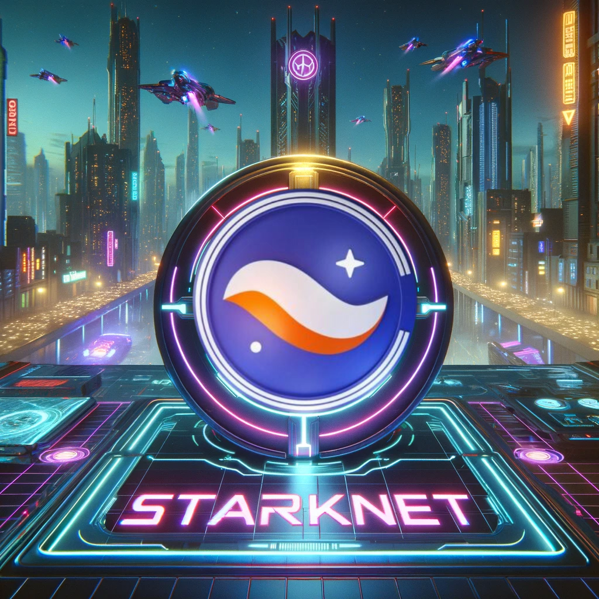
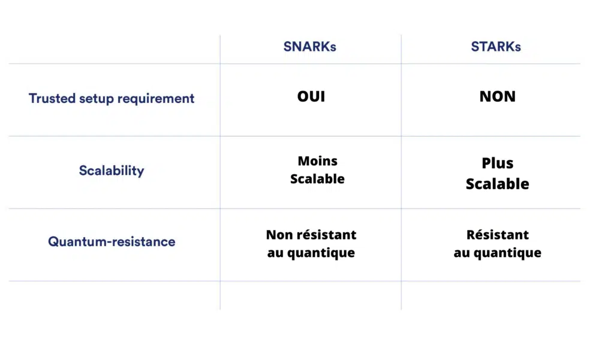

# Starknet, le L2 révolutionnaire

  

#### Introduction à StarkNet

StarkNet est une innovation majeure dans l'écosystème blockchain, créée par l'entreprise StarkWare. Il s'agit d'un Rollup STARK (Zero-Knowledge Scalable Transparent ARguments of Knowledge) de L2, décentralisé et permissionless, qui se superpose à Ethereum. Utilisant le langage Turing-complet Cairo, StarkNet promet d'apporter une solution pour scaler Ethereum.

---

#### Les Fondations de StarkNet : Cairo et Plus

**Zero-Knowledge Proofs** :

- Les preuves Zero-Knowledge (ZK) sont des preuves cryptographiques qui permettent de prouver qu'une information est vraie sans révéler l'information elle-même. Elles sont utilisées pour prouver la validité des transactions sur StarkNet. Les preuves ZK sont transparentes, ce qui signifie qu'elles ne nécessitent pas de confiance dans un vérificateur.

Prenons l'exemple du jeu "Où est Charlie ?" : Charlie est caché dans une foule et vous devez le trouver. Vous pouvez prouver que vous avez trouvé Charlie en le montrant à un ami, mais vous ne voulez pas que votre ami sache où il se trouve. Vous pouvez utiliser une preuve ZK pour prouver que vous avez trouvé Charlie sans révéler son emplacement. Une illustration de cela serait de montrer à votre ami une photo de Charlie avec un cercle rouge autour de lui. Votre ami peut voir que Charlie est dans le cercle, mais ne peut pas voir où se trouve le cercle.

**Cairo, Langage Révolutionnaire** :

- Cairo est un langage de haut niveau et Turing-complet, spécialement conçu pour produire des preuves STARK pour tout type de calcul. Pour faire du ZK, il faut au préalable transformer un problème (comme le "Où est Charlie) en un circuit arithmétique (un ensemble de formule mathématiques complexes). Avant Cairo, il fallait créer ces circuits à la main, ce qui était très fastidieux et source d'erreurs.
  Cairo permet de faire cela de manière automatique. Il rend la création de "circuits" complexes superflue et est déjà en production sur le Mainnet.

## STARKs vs SNARKs

Starknet, comme son nom l'indique, utilise des STARKs. Mais qu'est-ce que c'est ? Et comment se comparent-ils aux SNARKs ?

**SNARKS** :

- Les zk-SNARKs (arguments de connaissance succincts non interactifs à divulgation nulle de connaissance) sont des protocoles cryptographiques permettant de prouver la possession d'une information sans en révéler le contenu. Ils sont utiles dans les cryptomonnaies pour la confidentialité des transactions. Fonctionnant sur le principe des preuves à divulgation nulle de connaissance, ils impliquent un prouveur et un vérificateur, où le prouveur convainc le vérificateur de la possession d'un "témoin" sans le révéler. Les zk-SNARKs sont succincts, non interactifs, mais nécessitent une configuration initiale sécurisée, ce qui peut poser des problèmes de centralisation. Zcash est un exemple de cryptomonnaie utilisant les zk-SNARKs.

**STARKS** :

- Les zk-STARKs (arguments de connaissance succincts transparents à divulgation nulle de connaissance), quant à eux, offrent une approche similaire mais sans la nécessité d'une configuration initiale sécurisée. Ils utilisent une cryptographie symétrique basée sur des fonctions de hachage résistantes aux collisions, sont résistants aux ordinateurs quantiques, et offrent une efficacité de communication accrue.

La principale différence entre les zk-SNARKs et les zk-STARKs réside dans la configuration initiale et la résistance aux menaces quantiques. Les zk-SNARKs nécessitent une configuration initiale qui peut créer des problèmes de confiance, tandis que les zk-STARKs éliminent ce besoin. De plus, les zk-STARKs sont conçus pour être résistants aux attaques quantiques potentielles, contrairement aux zk-SNARKs.

Les zk-SNARKs et les zk-STARKs jouent tous deux un rôle crucial dans l'amélioration de la confidentialité et de la sécurité des transactions sur la blockchain, bien qu'ils atteignent ces objectifs de manières différentes. Le choix entre les deux dépend des besoins spécifiques en termes de sécurité, de rapidité et de transparence.

  

