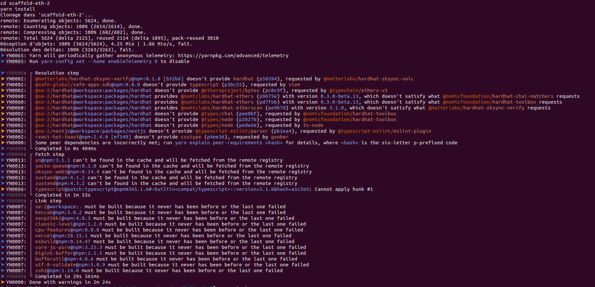
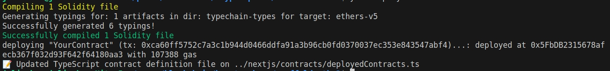
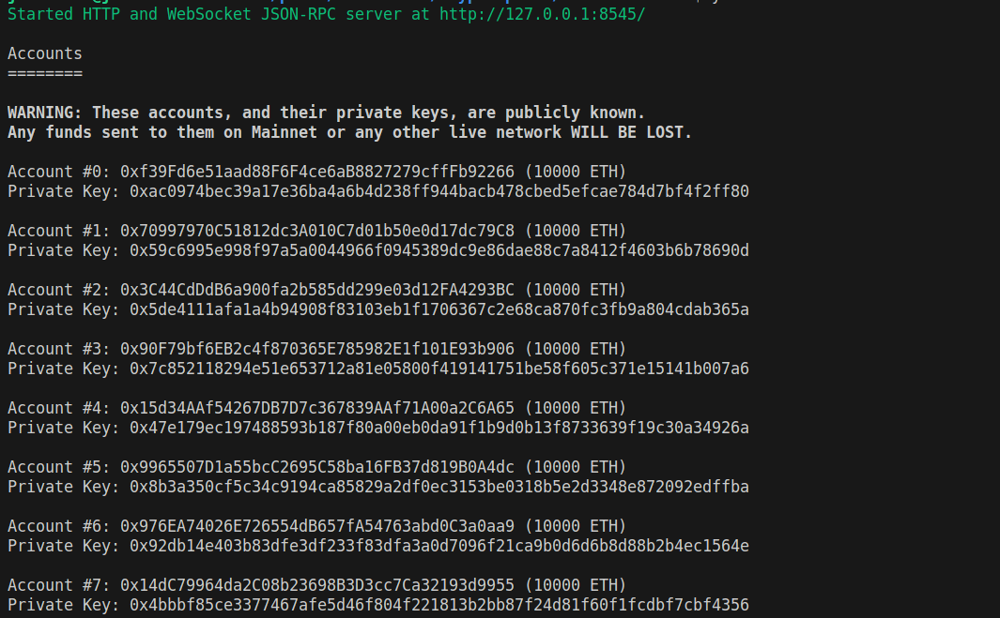

# Workshop n°2, Intégration d'un Frontend + Smart Contract

<p align="center">
  
</p>

Cette semaine nous verrons comment créer une dApp complète. On parle de dApp (decentralized Application) quand on a un smart contract qui est déployé sur la blockchain et un frontend qui permet d'interagir avec ce smart contract. Nous utiliserons le framework [Scaffold-eth](https://github.com/scaffold-eth/scaffold-eth) qui permet de créer une dApp en quelques minutes, pour faire un système de vote décentralisé.

**⚠️** Bien que le sujet semble long, il y a beaucoup de blabla et de détails, mais le code à écrire est court et simple (pour la première partie du moins). La correction est disponible [ici](correction)**⚠️**

---

#### Prérequis

- Syntaxe de base de Solidity (variables, fonctions, types de données, etc, voir [Workshop 1](https://github.com/julienbrs/kryptosphere-ensimag/tree/main/workshops/workshop1))
- Node.js installé (version 12 ou plus)
- Git installé
- Un éditeur de code (recommandé : Visual Studio Code)
- Un navigateur avec Metamask installé

---

#### Partie 1: Installation et Configuration de Scaffold-eth

1. **Cloner Scaffold-eth et Installer les Dépendances**:

   - Ouvrez un terminal et exécutez:

     ```
     git clone https://github.com/scaffold-eth/scaffold-eth-2.git
     cd scaffold-eth-2
     yarn install
     ```

   - Si vous n'avez pas `yarn` d'installé, vous pouvez l'installer avec `npm install -g yarn`. Vérifiez que `yarn` est bien installé en exécutant `yarn --version`.

Si votre écran ressemble à l'image suivante, c'est que tout s'est bien passé, vous êtes prêts à commencer!


2. **Présentation de Scaffold-Eth**

Grâce à Scaffold-Eth, vous allez pouvoir faire tourner votre propre blockchain en local sur votre ordinateur, déployer votre smart contract dessus (sans avoir à payer de frais de transaction et avec une rapidité instantané, car vous êtes le seul utilisateur sur votre blockchain locale), et lancer un frontend qui se génère tout seul pour s'adapter à votre smart contract. Scaffold-Eth est donc un outil très puissant pour développer des dApps rapidement et facilement.

---

#### Partie 2: Création et Déploiement du Smart Contract 'Simple Storage'

Nous allons maintenant créer un smart contract très simple qui vous permettra de stocker une valeur dans une variable. Nous allons ensuite déployer ce smart contract sur la blockchain locale.

1. **Développement du Smart Contract**:

   - Ouvrez `packages/hardhat/contracts` dans votre éditeur de code.
   - Remplacez le contenu du fichier `YourContract.sol` par le code suivant:

     ```
     // SPDX-License-Identifier: MIT
     pragma solidity ^0.8.0;

     contract YourContract {
            ... secreteValue;  // variable privée

            function setValue(...) public { // fonction publique, mettez le bon type de paramètre
                ...                         // mettez à jour la variable value
            }

     }
     ```

    - Finissez ce smart-contract. Il doit avoir une variable `secreteValue` de type `uint256` (entier non signé sur 256 bits). Cette variable sera privée, c'est-à-dire que seul le smart contract pourra y accéder.
   - Ajoutez un constructeur qui prend en paramètre un `uint256` et qui initialise la variable `secreteValue` avec la valeur passée en paramètre.
   - Ajoutez une fonction `setValue` qui prend en paramètre un `uint256` et qui met à jour la variable `secreteValue` avec la valeur passée en paramètre.


2. **Déploiement Local**:

   1. Lancement d'une blockchain locale:

      - Exécutez `yarn chain` dans le terminal.
      - Vous devriez voir une liste de comptes avec des clés privées associées. Ces comptes sont ceux qui seront utilisés pour déployer le smart contract et interagir avec lui.

   2. Déploiement du smart contract
      - Dans un autre terminal, exécutez `yarn deploy`. Cela exécutera le script `00_deploy_your_contract.ts` se trouvant dans `packages/hardhat/deploy/` qui déploiera le smart contract sur la blockchain locale.
        Vous devriez voir un message `YourContract deployed at: 0x...` qui indique que le smart contract a bien été déployé à l'addresse `0x...`.
        

---

#### Partie 3: Intégration Front-End

Dans la réalité, il faudrait maintenant que vous écriviez un frontend de toute pièce pour interagir avec votre smart contract. Cependant, Scaffold-Eth permet de générer un frontend tout seul, en fonction du smart contract que vous avez déployé.
Il vous suffit de lancer la commande `yarn start` dans un nouveau terminal pour lancer le frontend (vous devriez avoir 3 terminal d'ouvert en tout actuellement). Allez voir la page `http://localhost:3000/`. Vous pouvez alors:

- explorer l'historique de votre blockchain locale (il ne devrait y avoir qu'une transactions de déploiement actuellement) sur [cette page](http://localhost:3000/blockexplorer).
- tester votre smart contract et interagir avec lui sur [cette page](http://localhost:3000/debug). N'oubliez pas de connecter votre Metamask a votre blockchain locale (si ce n'est pas le cas, cliquez sur le bouton en haut à droite "Wrong Network" de votre frontend).

Pour tester votre smart contract, il faudra importer un compte test de votre blockchain locale dans votre Metamask. Allez dans votre tout premier terminal lancé (où votre blockchain tourne), remontez tout en haut et copiez une private key:


**⚠️ Warning:** These private keys are for testing purposes only on your local blockchain. Never use them on a real blockchain because anyone can access them and steal your funds.

After copying a private key, go to Metamask and import an account using this private key ([help here](https://support.metamask.io/hc/en-us/articles/360015489331-How-to-import-an-account#:~:text=Click%20the%20account%20selector%20at,directed%20to%20the%20Import%20page)). You should now have 2 accounts in your Metamask: the first one is your main Metamask account, the second one is the account you just imported. You can switch between accounts, please use the one you just imported because he already got some ETH on it.

---

#### Partie 4: Démonstration de la Non-Sécurité

Utilisez l'explorateur du frontend pour voir les transactions de votre blockchain locale, et analysez les pour voir si votre `secretValue` est vraiment si secrete que ça.

---

## Partie 5: Création du Smart Contract DAO

Nous allons maintenant créer un smart contract qui permettra de voter pour une proposition. Ce smart contract sera déployé sur la blockchain locale, et nous allons créer un frontend pour interagir avec lui.

*Ce que nous allons faire est un exemple extrêmement simplifié d'une DAO.
Une DAO est une organisation décentralisée, c'est-à-dire qu'elle n'est pas contrôlée par une entité centrale, mais par ses membres. Les membres de la DAO peuvent voter pour des propositions, et si une proposition obtient assez de votes, elle est acceptée et exécutée on-chain. Pour plus d'informations sur les DAO, vous pouvez lire [cet article](https://journalducoin.com/lexique/dao/).*

Testez au fur et à mesure que vous avancez dans le développement du smart contract, en utilisant le frontend généré par Scaffold-Eth. (n'oubliez pas de re-déployer votre smart contract à chaque fois que vous le modifiez).

#### 1. Configuration de l'environnement:

  - Copiez le squelette du contrat fourni [ici](modeles/squelette_vote.sol) dans un nouveau contract `Voting.sol`, au même emplacement que `YourContract.sol`.
  - Remplacer le contenu du fichier de déploiement `packages/hardhat/deploy/00_deploy_your_contract.ts` par le code fourni [ici](modeles/00_deploy_your_contract.ts). 
  
   Il ya 3 mapping importants : 
  - `votes`: utilisé dans la structure `Poll` pour suivre le nombre de votes reçus par chaque option dans un sondage. Il associe un indice d'option (un uint256) au nombre de votes (uint256) que cette option a reçus. Par exemple, si l'option 1 a reçu 5 votes, le mapping stockera cette information sous la forme votes[1] = 5.

  - `hasVoted` : fait aussi partie de `Poll`, est utilisé pour suivre si un utilisateur a déjà voté dans un sondage spécifique.

  -  `polls` : utilisé pour stocker les sondages. Il associe un indice de sondage (un uint256) à un sondage (une structure `Poll`).

#### 2. Implémentation de createPoll:

  Objectif: Permettre à un utilisateur de créer un nouveau sondage.
  Instructions: Initialisez un nouveau Poll et stockez-le dans la variable polls.
  Points à considérer: Comment assurer que le nouveau sondage est correctement enregistré et accessible? (indice: utilisez le mapping `polls`)

#### 3. Implémentation de vote:

  Objectif: Permettre aux utilisateurs de voter sur un sondage spécifique.
  Instructions: Mettez à jour le sondage avec le vote de l'utilisateur.
  Points à considérer: Comment vérifier si un sondage existe? Comment empêcher un utilisateur de voter plusieurs fois? (indice: regardez l'exemple de code de la documentation sur [`require`](https://docs.soliditylang.org/en/v0.8.0/control-structures.html#error-handling-assert-require-revert-and-exceptions))

#### 4. Implémentation de getPoll:

  Objectif: Récupérer les détails d'un sondage spécifique.
  Instructions: Retournez la question, les options, et les nombres de votes pour chaque option.
  Points à considérer: Comment construire le tableau des décomptes de votes? (indice: utilisez une boucle for)

#### 5. Tests et Déploiement:

  Testez chaque fonction en utilisant le frontend généré par Scaffold-Eth.

Si vous avez réussi à aller jusqu'ici, félicitations! Vous avez de solides bases en développement de dApps!