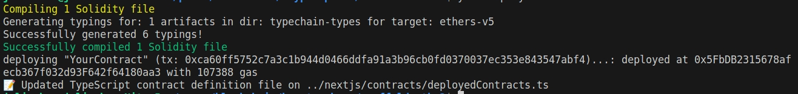
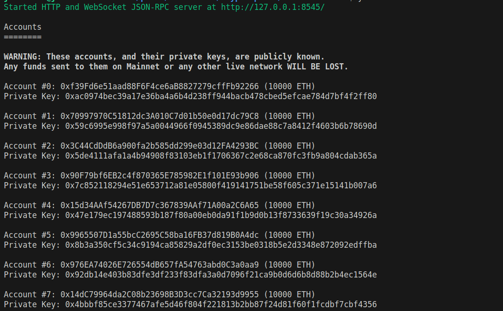

# Workshop n°2, Intégration d'un Frontend + Smart Contract


Cette semaine nous verrons comment créer une dApp complète. On parle de dApp (decentralized Application) quand on a un smart contract qui est déployé sur la blockchain et un frontend qui permet d'interagir avec ce smart contract. Nous utiliserons le framework [Scaffold-eth](https://github.com/scaffold-eth/scaffold-eth) qui permet de créer une dApp en quelques minutes.

---

#### Prérequis

- Syntaxe de base de Solidity (variables, fonctions, types de données, etc, voir [Workshop 1](https://github.com/julienbrs/kryptosphere-ensimag/tree/main/workshops/workshop1))
- Node.js installé (version 12 ou plus)
- Git installé
- Un éditeur de code (recommandé : Visual Studio Code)
- Un navigateur avec Metamask installé

---

#### Partie 1: Installation et Configuration de Scaffold-eth

1. **Cloner Scaffold-eth et Installer les Dépendances**:

   - Ouvrez un terminal et exécutez:

     ```
     git clone https://github.com/scaffold-eth/scaffold-eth-2.git
     cd scaffold-eth-2
     yarn install
     ```

   - Si vous n'avez pas `yarn` d'installé, vous pouvez l'installer avec `npm install -g yarn`. Vérifiez que `yarn` est bien installé en exécutant `yarn --version`.

2. **Présentation de Scaffold-Eth**

Grâce à Scaffold-Eth, vous allez pouvoir faire tourner votre propre blockchain en local sur votre ordinateur, déployer votre smart contract dessus (sans avoir à payer de frais de transaction et avec une rapidité instantané, car vous êtes le seul utilisateur sur votre blockchain locale), et lancer un frontend qui se génère tout seul pour s'adapter à votre smart contract. Scaffold-Eth est donc un outil très puissant pour développer des dApps rapidement et facilement.

---

#### Partie 2: Création et Déploiement du Smart Contract 'Simple Storage'

Nous allons maintenant créer un smart contract très simple qui vous permettra de stocker une valeur dans une variable. Nous allons ensuite déployer ce smart contract sur la blockchain locale.

1. **Développement du Smart Contract**:

   - Ouvrez `packages/hardhat/contracts` dans votre éditeur de code.
   - Créez un Smart Contract `YourContract` avec une variable `secreteValue` de type `uint256` (entier non signé sur 256 bits). Cette variable sera privée, c'est-à-dire que seul le smart contract pourra y accéder.
   - Ajoutez un constructeur qui initialise la variable `secreteValue` à 0.
   - Ajoutez une fonction `setValue` qui prend en paramètre un `uint256` et qui met à jour la variable `secreteValue` avec la valeur passée en paramètre.

   - Pour vous aider, voici le squelette du smart contract :

     ```
     // SPDX-License-Identifier: MIT
     pragma solidity ^0.8.0;

     contract YourContract {
            ... secreteValue;  // variable privée

            function setValue(...) public { // fonction publique, mettez le bon type de paramètre
                ...                         // mettez à jour la variable value
            }

     }
     ```

2. **Déploiement Local**:
   1. Lancement d'une blockchain locale:
        - Exécutez `yarn chain` dans le terminal.
        - Vous devriez voir une liste de comptes avec des clés privées associées. Ces comptes sont ceux qui seront utilisés pour déployer le smart contract et interagir avec lui.
    
    2. Déploiement du smart contract
        - Dans un autre terminal, exécutez `yarn deploy`. Cela exécutera le script `00_deploy_your_contract.ts` se trouvant dans `packages/hardhat/deploy/` qui déploiera le smart contract sur la blockchain locale.
        Vous devriez voir un message `YourContract deployed at: 0x...` qui indique que le smart contract a bien été déployé à l'addresse `0x...`.
        

---

#### Partie 3: Intégration Front-End

Dans la réalité, il faudrait maintenant que vous écriviez un frontend de toute pièce pour interagir avec votre smart contract. Cependant, Scaffold-Eth permet de générer un frontend tout seul, en fonction du smart contract que vous avez déployé.
Il vous suffit de lancer la commande `yarn start` dans un nouveau terminal pour lancer le frontend (vous devriez avoir 3 terminal d'ouvert en tout actuellement). Allez voir la page `http://localhost:3000/`. Vous pouvez alors:

- explorer l'historique de votre blockchain locale (il ne devrait y avoir qu'une transactions de déploiement actuellement) sur [cette page](http://localhost:3000/blockexplorer).
- tester votre smart contract et interagir avec lui sur [cette page](http://localhost:3000/debug). N'oubliez pas de connecter votre Metamask a votre blockchain locale (si ce n'est pas le cas, cliquez sur le bouton en haut à droite "Wrong Network" de votre frontend).

Pour tester votre smart contract, il faudra importer un compte test de votre blockchain locale dans votre Metamask. Allez dans votre tout premier terminal lancé (où votre blockchain tourne), remontez tout en haut et copiez une private key:


**⚠️ Warning:** These private keys are for testing purposes only on your local blockchain. Never use them on a real blockchain because anyone can access them and steal your funds.

After copying a private key, go to Metamask and import an account using this private key ([help here](https://support.metamask.io/hc/en-us/articles/360015489331-How-to-import-an-account#:~:text=Click%20the%20account%20selector%20at,directed%20to%20the%20Import%20page)). You should now have 2 accounts in your Metamask: the first one is your main Metamask account, the second one is the account you just imported. You can switch between accounts, please use the one you just imported because he already got some ETH on it.

---

#### Partie 4: Démonstration de la Non-Sécurité

Utilisez l'explorateur du frontend pour voir les transactions de votre blockchain locale, et analysez les pour voir si votre `secretValue` est vraiment si secrete que ça.

---
